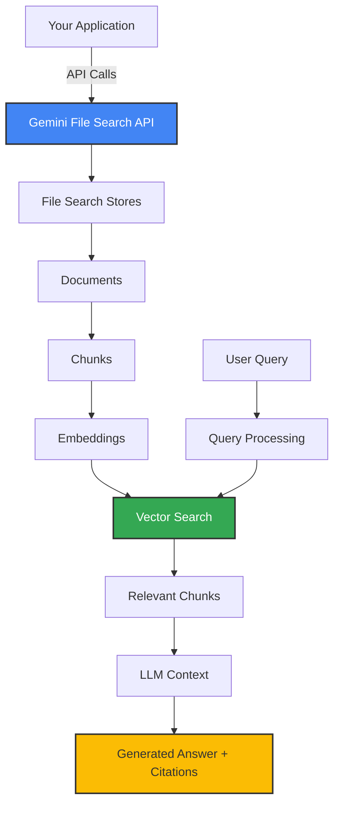
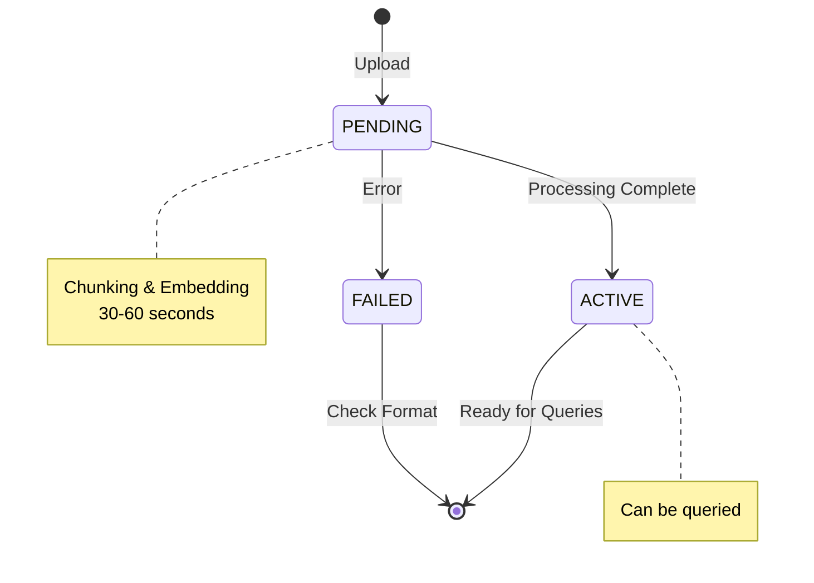
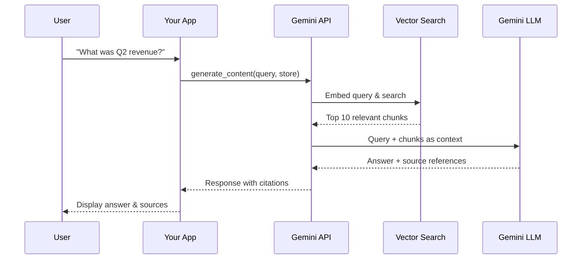
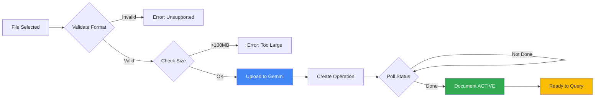

# Architecture Overview

Understand how Gemini File Search works under the hood.

## System Architecture



## Key Components

### 1. File Search Stores

**Purpose**: Containers for your documents

- One store per project or use case
- Tracks document metrics (active, pending, failed counts)
- Supports up to 1TB storage (paid tiers)

```python
store = client.file_search_stores.create(
    config={'display_name': 'My Project Docs'}
)
```

### 2. Documents

**Purpose**: Individual files you upload

- Support 100+ formats (PDF, DOCX, code, spreadsheets, etc.)
- Max 100MB per file (free tier)
- Progress through states: `PENDING` → `ACTIVE` → ready to query



### 3. Automatic Chunking

**What Gemini Does For You**:
- Intelligently splits documents into semantic chunks
- Preserves context across chunk boundaries
- Handles different file formats appropriately

**You don't need to**:
- Choose chunk size
- Handle overlap
- Split documents manually

### 4. Embeddings & Vector Search

**Behind the Scenes**:
1. Each chunk gets an embedding vector
2. Your query gets an embedding vector
3. Semantic similarity finds relevant chunks
4. Results ranked by relevance

**You interact with**: High-level API (no vector math required)

## Data Flow



## Upload Workflow



## Storage Tiers

| Tier | Storage | File Limit | Use Case |
|------|---------|------------|----------|
| Free | 1 GB | 100 MB | Personal, testing |
| Tier 1 | 10 GB | 100 MB | Small teams |
| Tier 2 | 100 GB | 100 MB | Medium projects |
| Tier 3 | 1 TB | 100 MB | Enterprise |

:::tip Performance
Keep stores <20GB for best latency. Create multiple stores for large datasets.
:::

## Integration Patterns

### Pattern 1: Single Store per User

```python
# User-specific document isolation
store = create_store(f'user-{user_id}-docs')
```

**Use case**: Personal document assistant, per-user knowledge base

### Pattern 2: Single Store per Project

```python
# Project-wide knowledge base
store = create_store(f'project-{project_id}-docs')
```

**Use case**: Team collaboration, shared documentation

### Pattern 3: Multiple Stores with Metadata

```python
# Separate by category, query across multiple
financial_store = create_store('financial-docs')
technical_store = create_store('technical-docs')

# Query both
response = query(
    'Find budget info',
    store_names=[financial_store.name, technical_store.name]
)
```

**Use case**: Large-scale document management, multi-category search

## Security & Access Control

**API Key Level**: All stores share same API key permissions

**Application Level**: Implement your own access control:

```python
# Example: User can only access their stores
def user_can_access_store(user_id: str, store_name: str) -> bool:
    # Check database for ownership
    return store_owner_id == user_id
```

## Performance Considerations

### Query Speed
- **First query**: ~2-3 seconds (cold start)
- **Subsequent queries**: ~500ms-1s
- **Store size impact**: <20GB optimal

### Upload Speed
- **Small files (<1MB)**: 5-10 seconds
- **Medium files (10MB)**: 30-60 seconds
- **Large files (50MB+)**: 2-5 minutes

### Optimization Tips
1. **Batch uploads** when possible
2. **Use metadata filters** to narrow search space
3. **Keep stores focused** (single topic/project)
4. **Monitor document states** before querying

## Next Steps

- [Understand Stores →](/en/concepts/stores)
- [Document Lifecycle →](/en/concepts/documents)
- [Semantic Search Deep Dive →](/en/concepts/semantic-search)
- [FastAPI Integration →](/en/guides/fastapi-integration)
