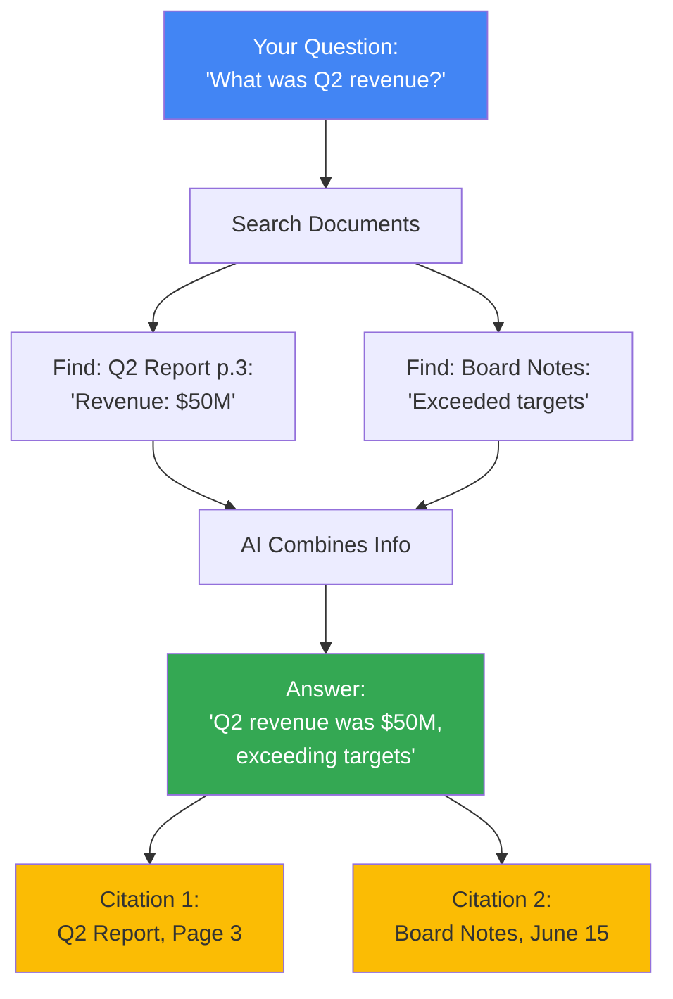

# Citations & Source Attribution

Understanding how Gemini File Search shows you exactly where answers come from.

## Why Citations Matter

Imagine asking a colleague "What was our Q2 revenue?" and they answer "$50 million."

**Your natural follow-up:** "Where did you see that?"

If they say "I don't remember," you can't verify the information. But if they say "Page 3 of the Q2 Financial Report," you can check it yourself.

**That's what citations do** - they show you exactly where the AI found each piece of information.

## The Trust Problem with AI

### AI Without Citations

Traditional AI systems often:
- Give confident answers
- Don't tell you where information came from
- Sometimes make up information ("hallucination")
- Leave you wondering: "Is this real or invented?"

**Example:**
**You ask:** "What was our customer churn rate last quarter?"
**AI answers:** "Your customer churn rate was 5.2%."
**Problem:** No way to verify if this is from your documents or made up.

### AI With Citations

Gemini File Search always:
- Shows exactly which document each fact came from
- Includes page numbers or section references
- Lets you verify every claim
- Distinguishes between document facts and AI inferences

**Same example with citations:**
**You ask:** "What was our customer churn rate last quarter?"
**AI answers:** "Your customer churn rate was 5.2%."
**Citations:**
- Q3 Metrics Dashboard, Page 2
- Customer Analytics Report, Section 4.1

**Now you can verify!**

## How Citations Work



### What You Get

Every answer includes:
1. **The answer text** - Natural language response
2. **Source documents** - Which files were used
3. **Specific locations** - Page numbers, sections, timestamps
4. **Relevance** - How relevant each source was

## Real-World Example

**Scenario:** You're an HR manager preparing a presentation about employee benefits.

**Question:** "What health insurance options do we offer?"

**Answer:**
"We offer three health insurance plans: Basic PPO ($150/month employee contribution), Premium PPO ($250/month), and High-Deductible HSA ($50/month with employer HSA contribution of $1,000 annually). All plans include vision and dental coverage."

**Citations:**
1. **Employee Benefits Guide 2024**, Page 12
   - "PPO plans available: Basic ($150/mo) and Premium ($250/mo)"
2. **Benefits Summary**, Section 3
   - "HDHP with HSA: $50/mo employee, $1,000 employer annual contribution"
3. **Insurance Coverage Details**, Page 5
   - "All health plans include vision and dental at no additional cost"

**What you can do:**
- Click each citation to see the exact context
- Verify numbers are correct
- Check if information is current
- Find additional details in source documents

## Types of Information

### Quoted Facts (Most Reliable)

When the AI quotes directly from your documents:

**Document says:** "Q2 revenue was $50 million"
**AI says:** "Q2 revenue was $50 million"
**Citation:** Q2 Report, Page 3 ✓

This is the most trustworthy - direct quote with source.

### Synthesized Information (Check Sources)

When the AI combines information from multiple sources:

**Document 1:** "Q1 revenue: $40M"
**Document 2:** "Q2 revenue: $50M"
**AI says:** "Revenue grew 25% from Q1 to Q2"
**Citations:** Both documents ⚠️

The AI calculated the 25% - always verify calculations by checking cited sources.

### Inferred Information (Verify Carefully)

When the AI makes reasonable inferences:

**Document says:** "Launch scheduled for June 15"
**Your question:** "Is the product launched yet?" (asked June 20)
**AI says:** "Yes, the product launched on June 15 (5 days ago)"
**Citation:** Product Roadmap ⚠️

The AI inferred it's launched based on the date - check if delays occurred.

## What Google Does Differently

### Most RAG Systems

You get:
- An answer
- Maybe a document name
- No specific page/section
- Hard to verify

**Example response:**
"Q2 revenue was $50 million (from financial_report.pdf)"

You still need to open the PDF and search through pages.

### Gemini File Search

You get:
- An answer
- Specific document name
- Exact page or section
- Relevance score
- Direct context snippet

**Example response:**
"Q2 revenue was $50 million"

**Citation with context:**
```
Document: Q2 Financial Report 2024
Page: 3
Section: Revenue Summary
Context: "...quarterly revenue reached $50 million,
representing 25% growth year-over-year..."
```

You can verify immediately without opening files.

## How to Use Citations Effectively

### 1. Always Check High-Impact Decisions

Before acting on AI responses for:
- Financial decisions
- Legal matters
- Policy changes
- Public statements

**Always verify the citations** by reading the source material.

### 2. Look for Multiple Sources

Stronger evidence when multiple documents say the same thing:

**Weak:** One citation from meeting notes
**Strong:** Citations from official report + meeting notes + dashboard

### 3. Check Document Dates

Make sure information is current:

**Question:** "What's our return policy?"
**Citation:** Customer Policy 2020 ⚠️

If it's 2024, check if policy changed.

### 4. Understand Source Reliability

Consider document type:
- **Official reports** - High reliability
- **Meeting notes** - Opinions/discussions, may not be final
- **Draft documents** - May have changed
- **Email threads** - Informal, context-dependent

## Privacy & Confidentiality

**Important:** Citations show exactly where information came from, including:
- Document names
- Page numbers
- Text snippets

If you're sharing AI responses with others, be aware:
- Citations might reveal confidential sources
- Consider removing citations for sensitive data
- Or restrict who can see the response

**Example:** Answering investor questions with internal financial documents - share the answer but review citations first.

## Troubleshooting Citations

### Problem: No Citations in Answer

**Possible causes:**
1. **AI used general knowledge** - Question too general, didn't match documents
2. **Documents not processed** - Check STATE_ACTIVE
3. **No relevant information** - Your documents don't contain the answer

**Solution:** Make questions more specific to your document content.

### Problem: Wrong Citations

**Possible causes:**
1. **Ambiguous question** - AI found different information than intended
2. **Multiple similar documents** - Picked wrong one
3. **Outdated information** - Found old version

**Solution:** Add context to your question (dates, document names, specific topics).

### Problem: Too Many Citations

**Possible causes:**
1. **Broad question** - AI pulled from many sources
2. **Repeated information** - Same fact in multiple documents

**Solution:** This is usually good - shows comprehensive coverage. Filter by relevance score.

## Extracting Citations from Responses

When working with the API, citations are in the response metadata:

```python
response = client.models.generate_content(
    model='gemini-2.5-flash',
    contents='What was Q2 revenue?',
    config=types.GenerateContentConfig(
        tools=[types.Tool(
            file_search=types.FileSearch(
                file_search_store_names=[store.name]
            )
        )]
    )
)

# Get the answer
print(response.text)

# Get citations (grounding metadata)
for candidate in response.candidates:
    if hasattr(candidate, 'grounding_metadata'):
        for chunk in candidate.grounding_metadata.grounding_chunks:
            print(f"Document: {chunk.document_name}")
            print(f"Relevance: {chunk.relevance_score}")
```

:::warning Safe Access
Always check if grounding_metadata exists - not all responses have citations.
:::

## Best Practices

1. **Trust but verify** - Citations are accurate, but always check for critical decisions
2. **Check multiple sources** - Stronger evidence when multiple documents agree
3. **Consider document types** - Official reports > informal notes
4. **Verify dates** - Make sure information is current
5. **Use citations for transparency** - Show stakeholders where information came from
6. **Filter by relevance** - Focus on high-relevance citations first
7. **Preserve context** - Read surrounding text in source documents

## Key Takeaways

1. **Citations = Trust** - Know exactly where every fact came from
2. **Always provided** - Gemini File Search includes citations automatically
3. **Verifiable** - Check sources yourself anytime
4. **Specific** - Exact page/section references, not just file names
5. **Multiple types** - Quoted facts, synthesized info, inferences
6. **Your responsibility** - Verify critical information before acting
7. **Unique to Google** - More detailed than typical RAG systems

**Bottom line:** Citations transform AI from "trust me" to "here's the proof" - you get answers AND the ability to verify every claim.

## Next Steps

- [Query Your Documents →](../guides/query)
- [Understanding Semantic Search →](./semantic-search)
- [Document Metadata →](../guides/metadata-filtering)
