# What is Semantic Search?

Understanding how Gemini File Search actually works.

## The Problem

Imagine you have 100 PDF documents and you want to find information. Traditional approaches:

**❌ Manual Search:**
- Open each PDF
- Read through pages
- Take notes
- Takes hours or days

**❌ Keyword Search (Ctrl+F):**
- Only finds exact word matches
- Misses synonyms and related concepts
- Example: Search "revenue" won't find "income" or "sales"

**✓ Semantic Search:**
- Understands **meaning**, not just words
- Finds relevant information even with different wording
- Like having a smart assistant who read everything

## How Does It Work?

Think of it like this:

### 1. You Have Documents

Let's say you upload financial reports, meeting notes, and product documentation.

### 2. Gemini "Reads" Everything

Behind the scenes:
- **Breaks documents into chunks** - Like dividing a book into chapters
- **Understands each chunk** - What is this section about?
- **Creates a "memory"** - Stores the meaning, not just words

:::tip Analogy
It's like a librarian who read all your books and can tell you exactly which book and page has the answer to any question.
:::

### 3. You Ask a Question

Instead of searching for keywords, you ask naturally:

**You ask:** "What was our Q2 performance?"

**Gemini understands you mean:**
- Revenue numbers
- Growth metrics
- Quarterly results
- Performance indicators

### 4. Gemini Finds Relevant Information

It searches by **meaning**, finding:
- "Second quarter revenue: $50M"
- "Q2 growth exceeded targets"
- "April-June financial summary"

Even though you didn't use those exact words!

### 5. You Get an Answer with Sources

**Answer:** "In Q2 2024, the company achieved $50 million in revenue, representing 25% growth. Performance exceeded targets across all metrics."

**Sources:**
- Q2 Financial Report, Page 3
- Board Meeting Notes, June 15
- Performance Dashboard

## What Makes This Special?

### Traditional Search vs Semantic Search

```mermaid
graph TB
    subgraph Traditional["❌ Traditional Keyword Search"]
        A1[Search: 'revenue'] --> B1[Find exact word 'revenue']
        B1 --> C1[Miss: income, sales, earnings]
    end

    subgraph Semantic["✓ Semantic Search"]
        A2[Search: 'revenue'] --> B2[Understand: financial performance]
        B2 --> C2[Find: revenue, income, sales, earnings, performance]
    end

    style Semantic fill:#34a853,color:#fff
    style Traditional fill:#ea4335,color:#fff
```

**Example Scenarios:**

| Your Question | Traditional Search | Semantic Search |
|--------------|-------------------|-----------------|
| "How many employees?" | Finds "employees" only | Finds: staff, team members, workforce, headcount |
| "What's our biggest risk?" | Needs exact word "risk" | Finds: challenges, threats, concerns, vulnerabilities |
| "Customer complaints" | Finds word "complaints" | Finds: feedback, issues, concerns, dissatisfaction |

## Real-World Example

**Scenario:** You're preparing for a board meeting and need to know about product launch success.

**Traditional approach:**
1. Open 20 different documents
2. Search each one for "product launch"
3. Read through results
4. Compile information manually
5. **Time: 2-3 hours**

**With Semantic Search:**
1. Ask: "How did the product launch go?"
2. Get instant answer with all relevant info
3. See exactly which documents it came from
4. **Time: 30 seconds**

## Understanding RAG (Retrieval-Augmented Generation)

**RAG** is the technology behind this magic. Let's break it down:

### What is RAG?

**R**etrieval - Finding relevant information
**A**ugmented - Adding it as context
**G**eneration - Creating a natural answer

Think of it as:
1. **Retrieval:** Finding the right books in a library
2. **Augmented:** Giving those books to an expert
3. **Generation:** The expert writes you a summary

### The Flow

### Why RAG is Powerful

**Without RAG:**
- AI only knows what it was trained on
- Can't answer questions about YOUR documents
- Makes up information ("hallucination")

**With RAG:**
- AI reads YOUR specific documents
- Answers based on YOUR data
- Cites exact sources
- No made-up information

## Google's Unique Approach

### What Makes Gemini File Search Different?

Most RAG systems require you to:
1. **Manually chunk** documents (decide how to split them)
2. **Generate embeddings** (convert text to numbers)
3. **Manage vector database** (store and search)
4. **Tune parameters** (chunk size, overlap, etc.)
5. **Maintain infrastructure** (servers, databases)

**Google's Gemini handles ALL of this automatically.**

You just:
1. Upload files
2. Ask questions
3. Get answers

That's it.

### The Technology Stack

```mermaid
graph TB
    U[You Upload<br/>Documents] --> G[Google Gemini]

    subgraph Google["🔒 Google Handles Everything"]
        G --> C[Automatic<br/>Chunking]
        C --> E[Generate<br/>Embeddings]
        E --> V[Vector<br/>Database]
        V --> S[Semantic<br/>Search]
    end

    Q[You Ask<br/>Question] --> S
    S --> A[AI Generates<br/>Answer]
    A --> Y[You Get Answer<br/>+ Citations]

    style Google fill:#f0f0f0
    style G fill:#4285f4,color:#fff
    style Y fill:#34a853,color:#fff
```

### Supported File Types (100+)

You can upload almost anything:

**Documents:**
- PDFs (reports, books, manuals)
- Word documents
- PowerPoint presentations
- Excel spreadsheets
- Plain text files

**Code:**
- Python, JavaScript, Java files
- Any programming language
- Configuration files

**Data:**
- CSV, JSON files
- YAML, XML files

**Web:**
- HTML pages
- Markdown documentation

**Archives:**
- ZIP files (automatically extracted)

## Use Cases

### For Business

**Customer Support:**
Upload all your product manuals, FAQs, and policies. Customer support agents can instantly find answers to customer questions.

**Legal/Compliance:**
Search through contracts, regulations, and policies to find specific clauses or requirements.

**Research:**
Analyze research papers, market reports, and competitive intelligence to find trends and insights.

### For Personal Use

**Study Assistant:**
Upload textbooks, lecture notes, and papers. Ask questions to study for exams.

**Document Manager:**
Upload all your personal documents (tax records, medical records, etc.) and find information instantly.

**Knowledge Base:**
Build your personal knowledge repository - upload articles, notes, and references.

### For Developers

**Code Documentation:**
Upload your codebase and documentation. Ask questions about how specific features work.

**API Integration:**
Search through API documentation to find the right endpoints and examples.

## How Accurate Is It?

### What You Can Trust

**✓ Factual Information:**
If it's explicitly stated in your documents, Gemini will find it accurately.

Example: "What was the Q2 revenue?"
- If document says "$50 million" → Answer: "$50 million" ✓

**✓ Direct Quotes:**
Information taken directly from your documents is reliable.

**✓ Citations:**
Every answer shows you exactly where it came from, so you can verify.

### What to Watch For

**⚠️ Inferences:**
The AI might make reasonable inferences that weren't explicitly stated.

Example: Document says "Q1: $40M, Q2: $50M"
Answer might say "25% growth" (calculated, not stated)

**⚠️ Missing Information:**
If your documents don't contain the answer, the AI might say "I don't have that information" OR use general knowledge.

**⚠️ Ambiguity:**
If documents contradict each other, you'll get one answer with citations - check the sources.

## Privacy & Security

### Your Data

- **Stored securely** in Google's infrastructure
- **Only you can access** your stores and documents
- **API key controls access** - keep it secret
- **Can be deleted** anytime

### What Google Does

- Processes your documents to enable search
- Stores embeddings (mathematical representations)
- Does NOT train public models on your data
- Does NOT share your data with others

## Limitations

**File Size:** 100MB per file (free tier)
**Storage:** 1GB total (free tier)
**Languages:** Works best with English (supports others)
**Updates:** Changes to documents require re-upload

## Next Steps

Now that you understand how it works:

- **[Try It Yourself →](../getting-started/setup)** - Set up in 5 minutes
- **[See Architecture →](./architecture)** - Technical deep dive
- **[Real Examples →](../guides/upload-documents)** - Common use cases

## Key Takeaways

1. **Semantic search = meaning-based search** (not keyword matching)
2. **RAG = finding + reading + answering** with your documents
3. **Gemini handles complexity** automatically (no setup needed)
4. **You get answers + citations** (always verify sources)
5. **Works with 100+ file types** (almost any document)
6. **Unique to Google** (fully managed, no infrastructure)

**Bottom line:** It's like having an AI assistant that read all your documents and can answer any question about them instantly, showing you exactly where it found the information.
