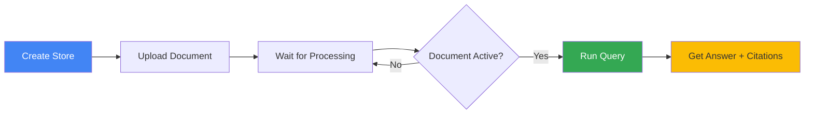
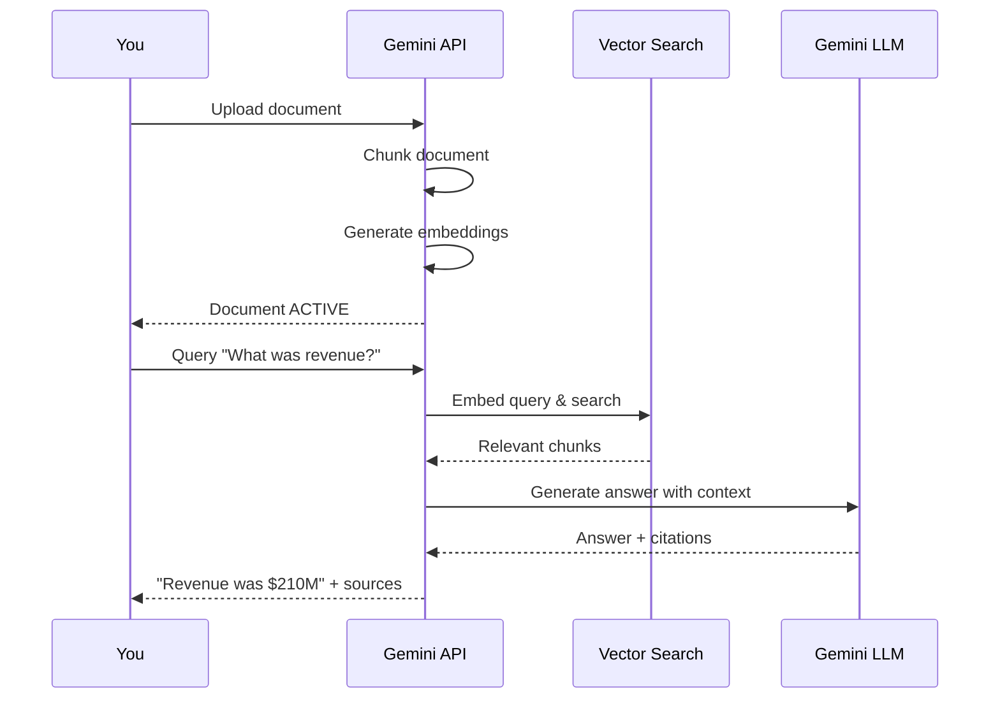

# Your First Query

Upload a document and run your first semantic search query.

## Complete Workflow

This guide walks through the entire process: upload → wait → query → get answer with citations.



## Step 1: Create Test Document

Let's create a sample document with some information to search:

<CodePlayground
  title="Create test document"
  language="python"
  :code="`# Create a test document with company information
test_content = '''
Acme Corp Annual Report 2024

Financial Summary:
- Q1 Revenue: $45 million
- Q2 Revenue: $50 million
- Q3 Revenue: $55 million
- Q4 Revenue: $60 million
- Total Annual Revenue: $210 million

Key Achievements:
- Launched new AI-powered product line
- Expanded to 5 new international markets
- Increased customer base by 40%
- Achieved 95% customer satisfaction rating

Employee Information:
- Total Employees: 250
- New Hires in 2024: 75
- Engineering Team: 120 employees
- Sales Team: 50 employees

Future Plans:
- Open 3 new regional offices in 2025
- Invest $20M in R&D
- Launch mobile application
- Achieve carbon neutrality by 2026
'''

# Write to file
with open('acme_report.txt', 'w', encoding='utf-8') as f:
    f.write(test_content)

print('✓ Test document created: acme_report.txt')
`"
/>

## Step 2: Upload Document

Upload your document to the store:

<CodePlayground
  title="Upload document to store"
  language="python"
  :code="`import os
from google import genai

# Initialize client
client = genai.Client(api_key=os.getenv('GEMINI_API_KEY'))

# Create or use existing store
store = client.file_search_stores.create(
    config={'display_name': 'Tutorial Documents'}
)
print(f'Using store: {store.name}')

# Upload the document
operation = client.file_search_stores.upload_to_file_search_store(
    file='acme_report.txt',
    file_search_store_name=store.name,
    config={
        'display_name': 'Acme Corp Annual Report 2024',
        'custom_metadata': [
            {'key': 'company', 'string_value': 'Acme Corp'},
            {'key': 'year', 'string_value': '2024'},
            {'key': 'type', 'string_value': 'annual-report'}
        ]
    }
)

print(f'Upload initiated: {operation.name}')
print(f'Operation done: {operation.done}')
`"
/>

## Step 3: Wait for Processing

Documents must reach `STATE_ACTIVE` before querying:

<CodePlayground
  title="Poll until document is ready"
  language="python"
  :code="`import time

# Poll operation status
print('Waiting for document processing...')
max_attempts = 30  # Max 60 seconds (30 * 2s)
attempts = 0

while not operation.done and attempts < max_attempts:
    operation = client.operations.get(name=operation.name)
    if operation.done:
        print('✓ Processing complete!')
        break
    print(f'  Still processing... ({attempts * 2}s)')
    time.sleep(2)
    attempts += 1

if not operation.done:
    print('✗ Timeout: Processing took longer than expected')
    exit(1)

# Verify document is active
documents = client.file_search_stores.documents.list(
    parent=store.name
)

for doc in documents:
    print(f'\\nDocument: {doc.display_name}')
    print(f'  State: {doc.state}')
    print(f'  Size: {doc.size_bytes:,} bytes')
    print(f'  MIME Type: {doc.mime_type}')

    if doc.state == 'STATE_ACTIVE':
        print('  ✓ Ready to query!')
    elif doc.state == 'STATE_PENDING':
        print('  ⏳ Still processing...')
    elif doc.state == 'STATE_FAILED':
        print('  ✗ Processing failed')
`"
/>

:::tip Processing Time
- Small files (<1MB): 5-10 seconds
- Medium files (1-10MB): 30-60 seconds
- Large files (10MB+): 1-5 minutes
:::

## Step 4: Run Your First Query

Now ask questions in natural language:

<CodePlayground
  title="Query with semantic search"
  language="python"
  :code="`from google.genai import types

# Ask a question
response = client.models.generate_content(
    model='gemini-2.5-flash',
    contents='What was the total annual revenue for Acme Corp in 2024?',
    config=types.GenerateContentConfig(
        tools=[types.Tool(
            file_search=types.FileSearch(
                file_search_store_names=[store.name]
            )
        )]
    )
)

# Print the answer
print('\\n' + '='*60)
print('ANSWER:')
print('='*60)
print(response.text)
print('='*60)

# Expected output:
# According to the Acme Corp Annual Report 2024,
# the total annual revenue was $210 million.
`"
/>

## Step 5: Extract Citations

Get sources for the answer:

<CodePlayground
  title="Safe citation extraction"
  language="python"
  :code="`# Extract citations with safe attribute checking
citations = []

if hasattr(response, 'candidates') and response.candidates:
    candidate = response.candidates[0]
    if hasattr(candidate, 'grounding_metadata'):
        grounding = candidate.grounding_metadata
        if hasattr(grounding, 'grounding_chunks'):
            for chunk in grounding.grounding_chunks:
                if hasattr(chunk, 'retrieved_context'):
                    ctx = chunk.retrieved_context
                    citations.append({
                        'title': getattr(ctx, 'title', 'Unknown'),
                        'uri': getattr(ctx, 'uri', '')
                    })

# Display citations
if citations:
    print('\\nSOURCES:')
    print('-' * 60)
    for i, citation in enumerate(citations, 1):
        print(f'{i}. {citation[\"title\"]}')
        if citation['uri']:
            print(f'   URI: {citation[\"uri\"]}')
else:
    print('\\nNo citations found (answer may be from model knowledge)')
`"
/>

## Try Different Queries

Let's ask various types of questions:

<CodePlayground
  title="Multiple query examples"
  language="python"
  :code="`queries = [
    'What was the Q2 revenue?',
    'How many employees does Acme Corp have?',
    'What are the future plans for 2025?',
    'What was the customer satisfaction rating?',
    'How many new hires were made in 2024?'
]

for query in queries:
    print(f'\\n{"="*60}')
    print(f'Q: {query}')
    print('-' * 60)

    response = client.models.generate_content(
        model='gemini-2.5-flash',
        contents=query,
        config=types.GenerateContentConfig(
            tools=[types.Tool(
                file_search=types.FileSearch(
                    file_search_store_names=[store.name]
                )
            )]
        )
    )

    print(f'A: {response.text}')
`"
/>

## Query with Metadata Filters

Filter searches by custom metadata:

<CodePlayground
  title="Query with metadata filter"
  language="python"
  :code="`# Query only documents from 2024 annual reports
response = client.models.generate_content(
    model='gemini-2.5-flash',
    contents='What was the annual revenue?',
    config=types.GenerateContentConfig(
        tools=[types.Tool(
            file_search=types.FileSearch(
                file_search_store_names=[store.name],
                # AIP-160 filter syntax
                metadata_filter='year=2024 AND type=annual-report'
            )
        )]
    )
)

print(response.text)
`"
/>

**Filter Syntax:**
- `AND`: `key1=value1 AND key2=value2`
- `OR`: `key1=value1 OR key2=value2`
- `NOT`: `key!=value`

## Complete Example Script

Here's everything together in one runnable script:

<CodePlayground
  title="complete_query_example.py"
  language="python"
  :code="`import os
import time
from google import genai
from google.genai import types
from dotenv import load_dotenv

# Setup
load_dotenv()
client = genai.Client(api_key=os.getenv('GEMINI_API_KEY'))

# 1. Create test document
with open('test_doc.txt', 'w') as f:
    f.write('''
    Acme Corp Q4 Report:
    Revenue: $60 million
    Employees: 250
    Customer Satisfaction: 95%
    ''')

# 2. Create store and upload
store = client.file_search_stores.create(
    config={'display_name': 'Test Store'}
)
print(f'Store: {store.name}')

operation = client.file_search_stores.upload_to_file_search_store(
    file='test_doc.txt',
    file_search_store_name=store.name,
    config={'display_name': 'Q4 Report'}
)

# 3. Wait for processing
while not operation.done:
    operation = client.operations.get(name=operation.name)
    time.sleep(2)
print('✓ Document ready!')

# 4. Query
response = client.models.generate_content(
    model='gemini-2.5-flash',
    contents='What was the Q4 revenue?',
    config=types.GenerateContentConfig(
        tools=[types.Tool(
            file_search=types.FileSearch(
                file_search_store_names=[store.name]
            )
        )]
    )
)

print(f'\\nAnswer: {response.text}')

# 5. Extract citations
if hasattr(response, 'candidates') and response.candidates:
    candidate = response.candidates[0]
    if hasattr(candidate, 'grounding_metadata'):
        grounding = candidate.grounding_metadata
        if hasattr(grounding, 'grounding_chunks'):
            print('\\nCitations:')
            for chunk in grounding.grounding_chunks:
                if hasattr(chunk, 'retrieved_context'):
                    ctx = chunk.retrieved_context
                    print(f'  - {getattr(ctx, \"title\", \"\")}')

# 6. Cleanup
client.file_search_stores.delete(
    name=store.name,
    config={'force': True}
)
print('\\n✓ Cleanup complete!')
`"
/>

## What Just Happened?



**The Process:**
1. **Chunking**: Document split into semantic chunks
2. **Embedding**: Each chunk gets a vector embedding
3. **Query Embedding**: Your question becomes a vector
4. **Similarity Search**: Find chunks similar to query
5. **Context Building**: Top chunks sent to LLM
6. **Answer Generation**: LLM generates answer citing sources

**You don't manage**: Chunking, embeddings, or vector search - Gemini handles it all!

## Common Query Patterns

### Ask for Specific Facts

```python
"What was the Q2 revenue?"
"How many employees work in engineering?"
"What is the customer satisfaction rating?"
```

### Ask for Summaries

```python
"Summarize the key achievements in 2024"
"What are the main financial highlights?"
"Give me an overview of future plans"
```

### Ask for Comparisons

```python
"Compare Q1 and Q2 revenue"
"How did employee count change from Q1 to Q4?"
"What's the difference between engineering and sales team sizes?"
```

### Ask for Analysis

```python
"What trends do you see in quarterly revenue?"
"What are the growth indicators?"
"What risks are mentioned in the report?"
```

## Troubleshooting

### Issue: Empty or Generic Answers

**Cause:** Document not fully processed or query too broad

**Solution:**
```python
# Check document state
docs = client.file_search_stores.documents.list(parent=store.name)
for doc in docs:
    print(f'{doc.display_name}: {doc.state}')
    # Should be STATE_ACTIVE

# Make query more specific
response = client.models.generate_content(
    model='gemini-2.5-flash',
    contents='According to the Acme Corp report, what was the exact Q2 2024 revenue figure?',
    # ...
)
```

### Issue: No Citations

**Cause:** Answer from model knowledge, not documents

**Solution:**
- Make query more specific to document content
- Check if document was uploaded successfully
- Verify document contains relevant information

### Issue: Query Timeout

**Cause:** Large store or complex query

**Solution:**
```python
# Use metadata filters to narrow search
response = client.models.generate_content(
    model='gemini-2.5-flash',
    contents=query,
    config=types.GenerateContentConfig(
        tools=[types.Tool(
            file_search=types.FileSearch(
                file_search_store_names=[store.name],
                metadata_filter='year=2024'  # Narrow scope
            )
        )]
    )
)
```

## Next Steps

Congratulations! You've completed your first semantic search with Gemini File Search. 🎉

**Learn More:**
- **[Understanding Semantic Search →](/en/concepts/semantic-search)**
- **[Advanced Metadata Filtering →](/en/guides/metadata-filtering)**
- **[Building a FastAPI Application →](/en/guides/fastapi-integration)**
- **[Complete Tutorial →](/en/tutorial/)**

**Try Building:**
- Personal knowledge base
- Customer support assistant
- Research document Q&A
- Code documentation search

## Quick Reference

```python
# Upload
operation = client.file_search_stores.upload_to_file_search_store(
    file='doc.pdf',
    file_search_store_name=store_name,
    config={'display_name': 'Document Name'}
)

# Wait
while not operation.done:
    operation = client.operations.get(name=operation.name)
    time.sleep(2)

# Query
response = client.models.generate_content(
    model='gemini-2.5-flash',
    contents='Your question here',
    config=types.GenerateContentConfig(
        tools=[types.Tool(
            file_search=types.FileSearch(
                file_search_store_names=[store_name]
            )
        )]
    )
)

print(response.text)
```

Happy querying! 🔍
