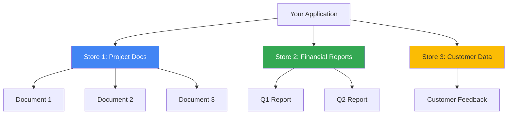

# Create Your First Store

Learn how to create and manage file search stores.

## What is a Store?

A **store** is a container for your documents - think of it like a folder or database for your files. Each store:

- Has a unique name (e.g., `fileSearchStores/store-abc123`)
- Contains multiple documents
- Tracks metrics (document counts, storage size)
- Can be queried independently or together with other stores



## Creating a Store

<CodePlayground
  title="Create a basic store"
  language="python"
  :code="`from google import genai
import os

# Initialize client
client = genai.Client(api_key=os.getenv('GEMINI_API_KEY'))

# Create store with display name
store = client.file_search_stores.create(
    config={'display_name': 'My Project Documentation'}
)

# Print store information
print(f'Store Name: {store.name}')
print(f'Display Name: {store.display_name}')
print(f'Created: {store.create_time}')

# Store name format: fileSearchStores/store-{random-id}
# Example: fileSearchStores/store-d0ttyrh6580l
`"
/>

**Output:**
```
Store Name: fileSearchStores/store-abc123xyz
Display Name: My Project Documentation
Created: 2024-11-13T10:30:00Z
```

:::tip Save the Store Name
Save the `store.name` value - you'll need it for uploading documents and querying!
:::

## Store Organization Strategies

### Strategy 1: One Store Per Project

Best for isolated projects with distinct document sets.

<CodePlayground
  title="Project-based stores"
  language="python"
  :code="`# Create separate stores for different projects
website_docs = client.file_search_stores.create(
    config={'display_name': 'Website Documentation'}
)

api_docs = client.file_search_stores.create(
    config={'display_name': 'API Reference Docs'}
)

internal_docs = client.file_search_stores.create(
    config={'display_name': 'Internal Wiki'}
)

print(f'Website: {website_docs.name}')
print(f'API: {api_docs.name}')
print(f'Internal: {internal_docs.name}')
`"
/>

**Pros:**
- Clear separation
- Easy to manage permissions
- Independent deletion

**Cons:**
- Can't query across projects easily
- More stores to manage

### Strategy 2: One Store with Metadata

Best for related documents that need cross-category search.

<CodePlayground
  title="Single store with metadata filtering"
  language="python"
  :code="`# Create one store for all company docs
company_docs = client.file_search_stores.create(
    config={'display_name': 'All Company Documents'}
)

# Upload documents with metadata to categorize
client.file_search_stores.upload_to_file_search_store(
    file='website_guide.pdf',
    file_search_store_name=company_docs.name,
    config={
        'display_name': 'Website Guide',
        'custom_metadata': [
            {'key': 'category', 'string_value': 'website'},
            {'key': 'department', 'string_value': 'engineering'}
        ]
    }
)

# Later, query with filters
# metadata_filter='category=website AND department=engineering'
`"
/>

**Pros:**
- Query across all documents
- Flexible filtering
- Easier maintenance

**Cons:**
- All documents in one store
- Larger store size

### Strategy 3: Per-User Stores

Best for multi-tenant applications with user isolation.

<CodePlayground
  title="User-specific stores"
  language="python"
  :code="`def create_user_store(user_id: str):
    \"\"\"Create a store for a specific user\"\"\"
    store = client.file_search_stores.create(
        config={'display_name': f'User {user_id} Documents'}
    )

    # Store mapping in your database
    # db.save(user_id, store.name)

    return store

# Create stores for different users
user_1_store = create_user_store('user-001')
user_2_store = create_user_store('user-002')

print(f'User 1: {user_1_store.name}')
print(f'User 2: {user_2_store.name}')
`"
/>

## Listing Stores

View all your existing stores:

<CodePlayground
  title="List all stores with metrics"
  language="python"
  :code="`# List stores (default page size: 10)
stores = client.file_search_stores.list(
    config={'page_size': 20}  # Max 20
)

# Print store information
for store in stores:
    print(f'\\n{store.display_name}')
    print(f'  Name: {store.name}')
    print(f'  Active Documents: {store.active_documents_count}')
    print(f'  Pending Documents: {store.pending_documents_count}')
    print(f'  Failed Documents: {store.failed_documents_count}')
    print(f'  Size: {store.size_bytes:,} bytes ({store.size_bytes / 1024 / 1024:.2f} MB)')
    print(f'  Created: {store.create_time}')

# Example output:
# My Project Documentation
#   Name: fileSearchStores/store-abc123
#   Active Documents: 5
#   Pending Documents: 1
#   Failed Documents: 0
#   Size: 15,728,640 bytes (15.00 MB)
#   Created: 2024-11-13T10:30:00Z
`"
/>

## Getting Store Details

Retrieve specific store information:

<CodePlayground
  title="Get single store details"
  language="python"
  :code="`# Get store by name
store = client.file_search_stores.get(
    name='fileSearchStores/store-abc123'
)

# Access metrics
print(f'Display Name: {store.display_name}')
print(f'Total Documents: {store.active_documents_count + store.pending_documents_count}')
print(f'Storage Used: {store.size_bytes / 1024 / 1024:.2f} MB')
print(f'Created: {store.create_time}')
print(f'Updated: {store.update_time}')

# Check if store is healthy
if store.failed_documents_count > 0:
    print(f'⚠️  Warning: {store.failed_documents_count} documents failed processing')
else:
    print('✓ All documents processed successfully')
`"
/>

## Deleting Stores

Remove stores you no longer need:

<CodePlayground
  title="Delete a store"
  language="python"
  :code="`# Delete empty store
client.file_search_stores.delete(
    name='fileSearchStores/store-abc123'
)

# Delete store with documents (requires force=True)
client.file_search_stores.delete(
    name='fileSearchStores/store-xyz789',
    config={'force': True}  # Cascade delete all documents
)

print('✓ Store deleted successfully')
`"
/>

:::warning Irreversible
Deleting a store is **permanent** and cannot be undone. All documents in the store will be deleted.
:::

## Store Limits

| Tier | Max Stores | Total Storage | Max File Size |
|------|-----------|---------------|---------------|
| Free | Unlimited | 1 GB | 100 MB |
| Tier 1 | Unlimited | 10 GB | 100 MB |
| Tier 2 | Unlimited | 100 GB | 100 MB |
| Tier 3 | Unlimited | 1 TB | 100 MB |

:::tip Performance
For best performance, keep individual stores under 20 GB. Create multiple stores for larger datasets.
:::

## Common Patterns

### Pattern: Store Factory

<CodePlayground
  title="Reusable store creation function"
  language="python"
  :code="`def create_project_store(
    project_name: str,
    description: str = ''
) -> str:
    \"\"\"
    Create a store for a project and return its name.

    Args:
        project_name: Human-readable project name
        description: Optional project description

    Returns:
        Store name (fileSearchStores/store-xxx)
    \"\"\"
    display_name = f'{project_name}'
    if description:
        display_name += f' - {description}'

    store = client.file_search_stores.create(
        config={'display_name': display_name}
    )

    print(f'✓ Created store: {store.display_name}')
    print(f'  Name: {store.name}')

    return store.name

# Usage
store_name = create_project_store(
    'Customer Support',
    'FAQs and support documentation'
)
`"
/>

### Pattern: Store Cleanup

<CodePlayground
  title="Delete old or empty stores"
  language="python"
  :code="`from datetime import datetime, timedelta

def cleanup_old_stores(days_old: int = 30):
    \"\"\"Delete stores older than specified days with no documents\"\"\"
    stores = client.file_search_stores.list(config={'page_size': 20})
    deleted_count = 0

    for store in stores:
        # Check if store is old
        created = datetime.fromisoformat(store.create_time.replace('Z', '+00:00'))
        age = datetime.now(created.tzinfo) - created

        # Delete if old and empty
        if age > timedelta(days=days_old) and store.active_documents_count == 0:
            try:
                client.file_search_stores.delete(name=store.name)
                print(f'✓ Deleted: {store.display_name}')
                deleted_count += 1
            except Exception as e:
                print(f'✗ Failed to delete {store.display_name}: {e}')

    print(f'\\nDeleted {deleted_count} old stores')

# Run cleanup
cleanup_old_stores(days_old=30)
`"
/>

## Troubleshooting

### Issue: "Store not found"

**Cause:** Wrong store name or store was deleted

**Solution:**
```python
# List all stores to find correct name
stores = list(client.file_search_stores.list())
for store in stores:
    print(f'{store.display_name}: {store.name}')
```

### Issue: "Storage limit exceeded"

**Cause:** Reached tier storage limit (1GB free tier)

**Solution:**
1. Delete unused stores
2. Delete old documents from stores
3. Upgrade to paid tier

```python
# Check current storage usage
stores = client.file_search_stores.list()
total_bytes = sum(store.size_bytes for store in stores)
print(f'Total storage: {total_bytes / 1024 / 1024:.2f} MB')
```

### Issue: Can't delete store with documents

**Cause:** Store contains documents

**Solution:**
```python
# Use force=True to cascade delete
client.file_search_stores.delete(
    name='fileSearchStores/store-abc123',
    config={'force': True}
)
```

## Next Steps

Now that you have a store, let's upload some documents:

- **[Upload Your First Document →](/en/getting-started/first-query)**
- **[Understanding Documents →](/en/concepts/documents)**
- **[Store Organization Best Practices →](/en/concepts/stores)**

## Quick Reference

```python
# Create store
store = client.file_search_stores.create(config={'display_name': 'Name'})

# List stores
stores = client.file_search_stores.list(config={'page_size': 10})

# Get store details
store = client.file_search_stores.get(name='fileSearchStores/store-id')

# Delete store
client.file_search_stores.delete(name='fileSearchStores/store-id', config={'force': True})
```

Store your store names - you'll need them for document operations! 💾
