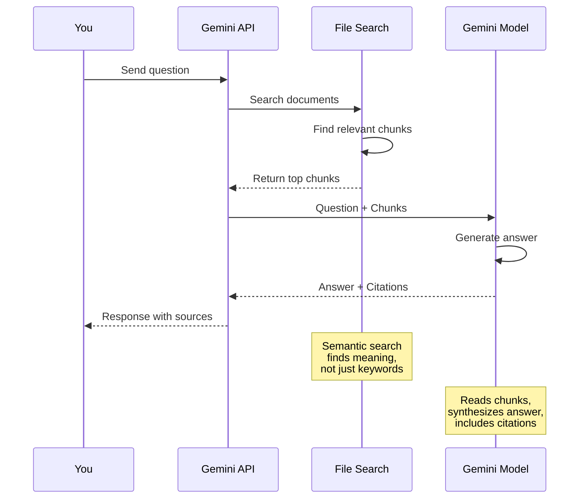

# Querying Documents

Complete guide to asking questions and getting answers from your documents.

## How Querying Works

Think of querying like asking a research assistant who has read all your documents:

1. **You ask a question** - "What was Q2 revenue?"
2. **Assistant searches documents** - Finds relevant sections
3. **Assistant reads the context** - Understands what's important
4. **Assistant answers** - Gives you a natural language response
5. **Assistant shows sources** - Points to exact pages/documents

All of this happens in seconds, automatically.

## Basic Query

### Simplest Example

```python
from google import genai
from google.genai import types

client = genai.Client(api_key='your-api-key')

response = client.models.generate_content(
    model='gemini-2.5-flash',
    contents='What was the Q2 revenue?',
    config=types.GenerateContentConfig(
        tools=[types.Tool(
            file_search=types.FileSearch(
                file_search_store_names=['fileSearchStores/your-store-id']
            )
        )]
    )
)

print(response.text)
```

**What this code does:**
- Sets up connection to Gemini API
- Asks natural language question: "What was Q2 revenue?"
- Tells Gemini to search your specific store for the answer
- File search finds relevant document sections automatically
- AI reads those sections and generates answer
- Prints the answer (like "$50 million" with context)

That's it! You get an answer based on your documents.

## Understanding the Query Flow



### What Happens Behind the Scenes

When you ask "What was Q2 revenue?":

1. **Query Analysis** (milliseconds)
   - Understand what you're asking
   - Extract key concepts: revenue, Q2, financial

2. **Semantic Search** (< 1 second)
   - Find document chunks about Q2 revenue
   - Rank by relevance
   - Return top 10-20 most relevant chunks

3. **Context Assembly** (milliseconds)
   - Combine relevant chunks
   - Prepare context for AI

4. **Answer Generation** (1-2 seconds)
   - AI reads the chunks
   - Synthesizes information
   - Generates natural language answer
   - Includes citations

**Total time:** 2-3 seconds typical

## Query Best Practices

### Good Questions

**Specific and Direct:**
```python
# ✓ Good
"What was the Q2 2024 revenue?"
"How many employees joined in June?"
"What are the key risks mentioned in the audit?"
```

**Why good:** Clear intent, specific timeframe or topic

**Vague and Broad:**
```python
# ❌ Not ideal
"Tell me about the company"
"What's in the documents?"
"Give me a summary"
```

**Why not ideal:** Too broad, AI doesn't know what you want

### Natural Language

You don't need special syntax - ask naturally:

```python
# All of these work:
"What was Q2 revenue?"
"Can you tell me the Q2 revenue?"
"I need to know the revenue for Q2"
"Q2 revenue please"
"revenue Q2"
```

The AI understands different phrasings.

### Context in Questions

Add context for better results:

```python
# Less specific
"What were the results?"

# More specific
"What were the Q2 2024 financial results for the Enterprise division?"

# Even more specific
"According to the Q2 board report, what were the financial results and how did they compare to targets?"
```

More context = better, more targeted answers.

## Query Types

### Factual Questions

Asking for specific information:

```python
# Numbers
"What was the total revenue?"
"How many customers do we have?"
"What's the error rate?"

# Dates
"When was the product launched?"
"What's the project deadline?"

# People
"Who is the project lead?"
"Who approved the budget?"

# Status
"What's the current status of Project Alpha?"
"Is the contract signed?"
```

### Analytical Questions

Asking for analysis or synthesis:

```python
# Comparisons
"How does Q2 compare to Q1?"
"What's the difference between Plan A and Plan B?"

# Trends
"What's the trend in customer growth?"
"How has performance changed over time?"

# Summaries
"Summarize the key points from the meeting"
"What are the main risks identified?"

# Reasons
"Why did revenue decline?"
"What caused the delay?"
```

### List Questions

Asking for multiple items:

```python
# Enumerations
"List all the action items from the meeting"
"What features are planned for next release?"
"What are the compliance requirements?"

# Top N
"What are the top 3 risks?"
"List the 5 largest customers"
```

## Filtering Queries

### Query Specific Documents

```python
# Search only Finance documents from 2024
response = client.models.generate_content(
    model='gemini-2.5-flash',
    contents='What was total revenue?',
    config=types.GenerateContentConfig(
        tools=[types.Tool(
            file_search=types.FileSearch(
                file_search_store_names=[store.name],
                metadata_filter='department=Finance AND year=2024'
            )
        )]
    )
)
```

**What this code does:**
- Adds metadata_filter to narrow search scope
- Only searches Finance department docs from 2024
- Ignores all other departments and years
- Faster query (fewer docs to search)
- More accurate answer (correct department + year guaranteed)

### Query Multiple Stores

```python
# Search across multiple stores
response = client.models.generate_content(
    model='gemini-2.5-flash',
    contents='What are the security requirements?',
    config=types.GenerateContentConfig(
        tools=[types.Tool(
            file_search=types.FileSearch(
                file_search_store_names=[
                    'fileSearchStores/security-docs',
                    'fileSearchStores/compliance-docs',
                    'fileSearchStores/engineering-docs'
                ]
            )
        )]
    )
)
```

**What this code does:**
- Searches 3 different stores at once
- Finds security requirements across security, compliance, AND engineering docs
- AI combines information from all 3 sources
- Good for: Questions spanning multiple document collections
- Result: Comprehensive answer pulling from all relevant stores

Searches all three stores simultaneously.

## Working with Responses

### Basic Response

```python
response = client.models.generate_content(
    model='gemini-2.5-flash',
    contents='What was Q2 revenue?',
    config=types.GenerateContentConfig(
        tools=[types.Tool(
            file_search=types.FileSearch(
                file_search_store_names=[store.name]
            )
        )]
    )
)

# Get answer text
answer = response.text
print(f'Answer: {answer}')
```

**What this code does:**
- Performs query and gets response object
- Extracts just the text answer from response
- response.text gives you the plain English answer
- Prints formatted answer
- Simple way to get answer without citations

### Extracting Citations

```python
# Get answer with citations
response = client.models.generate_content(
    model='gemini-2.5-flash',
    contents='What was Q2 revenue?',
    config=types.GenerateContentConfig(
        tools=[types.Tool(
            file_search=types.FileSearch(
                file_search_store_names=[store.name]
            )
        )]
    )
)

print(f'Answer: {response.text}\n')
print('Sources:')

# Extract citations safely
for candidate in response.candidates:
    if hasattr(candidate, 'grounding_metadata') and candidate.grounding_metadata:
        for chunk in candidate.grounding_metadata.grounding_chunks:
            # Extract document name from full path
            doc_name = chunk.document_name.split('/')[-1] if hasattr(chunk, 'document_name') else 'Unknown'
            relevance = getattr(chunk, 'relevance_score', 0)
            print(f'- {doc_name} (relevance: {relevance:.2f})')
```

**What this code does:**
- Gets answer from query
- Prints the answer text first
- Then extracts and prints source citations
- For each citation: gets document name and relevance score
- Shows which documents were used to generate the answer
- Relevance score shows how important each source was (0.0-1.0)
- Lets you verify answer accuracy by checking sources

### Complete Response Object

```python
response = client.models.generate_content(...)

# Answer text
answer = response.text

# Model used
model = response.model_version

# All candidates (usually just 1)
for candidate in response.candidates:
    # The answer
    content = candidate.content

    # Citations
    if hasattr(candidate, 'grounding_metadata'):
        citations = candidate.grounding_metadata.grounding_chunks

    # Finish reason
    finish_reason = candidate.finish_reason

    # Safety ratings
    safety_ratings = candidate.safety_ratings
```

## Handling Different Response Types

### When There's an Answer

```python
response = client.models.generate_content(
    model='gemini-2.5-flash',
    contents='What was Q2 revenue?',
    config=types.GenerateContentConfig(
        tools=[types.Tool(
            file_search=types.FileSearch(
                file_search_store_names=[store.name]
            )
        )]
    )
)

if response.text:
    print(f'Answer: {response.text}')
else:
    print('No answer found')
```

### When There's No Answer

If your documents don't contain the information:

```python
# Response might say:
"I don't have information about Q2 revenue in the available documents."
```

Or it might use general AI knowledge (without citations).

### When There Are Errors

```python
try:
    response = client.models.generate_content(
        model='gemini-2.5-flash',
        contents=query,
        config=types.GenerateContentConfig(
            tools=[types.Tool(
                file_search=types.FileSearch(
                    file_search_store_names=[store.name]
                )
            )]
        )
    )
    print(response.text)
except Exception as e:
    print(f'Query failed: {e}')
```

**What this code does:**
- Wraps query in try/except for error handling
- If query succeeds: prints answer normally
- If query fails: catches error and prints friendly message
- Prevents crashes from network issues, invalid stores, etc.
- Good practice for production code

## Multi-Turn Conversations

You can have follow-up conversations:

```python
# First query
response1 = client.models.generate_content(
    model='gemini-2.5-flash',
    contents='What was Q2 revenue?',
    config=types.GenerateContentConfig(
        tools=[types.Tool(
            file_search=types.FileSearch(
                file_search_store_names=[store.name]
            )
        )]
    )
)
print(response1.text)  # "$50 million"

# Follow-up query with history
response2 = client.models.generate_content(
    model='gemini-2.5-flash',
    contents=[
        types.Content(role='user', parts=[types.Part(text='What was Q2 revenue?')]),
        types.Content(role='model', parts=[types.Part(text=response1.text)]),
        types.Content(role='user', parts=[types.Part(text='How does that compare to Q1?')])
    ],
    config=types.GenerateContentConfig(
        tools=[types.Tool(
            file_search=types.FileSearch(
                file_search_store_names=[store.name]
            )
        )]
    )
)
print(response2.text)  # "Q2 revenue of $50M represents 25% growth from Q1's $40M"
```

**What this code does:**
- First query: Asks Q2 revenue, gets answer
- Second query: Builds conversation history (user→model→user)
- Includes previous question + answer in contents list
- Asks follow-up "How does that compare to Q1?"
- AI remembers "$50M" from first answer, compares to Q1
- Result: Contextual answer referencing previous conversation
- Like chatting with someone who remembers what you just discussed

The model remembers context and can answer follow-ups.

## Advanced Querying

### Combining Multiple Filters

```python
# Query Finance OR Sales, only 2024, only final documents
metadata_filter = '(department=Finance OR department=Sales) AND year=2024 AND status=final'

response = client.models.generate_content(
    model='gemini-2.5-flash',
    contents='What were the key achievements?',
    config=types.GenerateContentConfig(
        tools=[types.Tool(
            file_search=types.FileSearch(
                file_search_store_names=[store.name],
                metadata_filter=metadata_filter
            )
        )]
    )
)
```

### Dynamic Query Building

```python
def query_documents(question, department=None, year=None, category=None):
    """Query with optional filters"""
    filters = []

    if department:
        filters.append(f'department={department}')
    if year:
        filters.append(f'year={year}')
    if category:
        filters.append(f'category={category}')

    metadata_filter = ' AND '.join(filters) if filters else None

    response = client.models.generate_content(
        model='gemini-2.5-flash',
        contents=question,
        config=types.GenerateContentConfig(
            tools=[types.Tool(
                file_search=types.FileSearch(
                    file_search_store_names=[store.name],
                    metadata_filter=metadata_filter
                )
            )]
        )
    )

    return response.text

# Use it
answer = query_documents(
    question='What was total revenue?',
    department='Finance',
    year='2024'
)
```

**What this code does:**
- Flexible query function with optional filters
- Builds filter string dynamically based on what's provided
- If department given: adds department filter
- If year given: adds year filter
- Joins all filters with AND
- If no filters: searches everything
- Example: Queries Finance 2024 docs for revenue
- Reusable for any question + filter combination

## Performance Optimization

### Keep Queries Focused

**Slow:**
```python
# Searches all 1000 documents
response = client.models.generate_content(...)
```

**Fast:**
```python
# Searches only 50 relevant documents
response = client.models.generate_content(
    model='gemini-2.5-flash',
    contents=question,
    config=types.GenerateContentConfig(
        tools=[types.Tool(
            file_search=types.FileSearch(
                file_search_store_names=[store.name],
                metadata_filter='department=Finance AND year=2024'
            )
        )]
    )
)
```

Filtering reduces search space = faster queries.

### Use Flash for Speed

```python
# Faster, cheaper (use for most queries)
model='gemini-2.5-flash'

# Slower, more capable (use for complex analysis)
model='gemini-2.0-pro'
```

Flash is usually sufficient and much faster.

## Troubleshooting

### Empty or Generic Answers

**Problem:** Response doesn't use your documents

**Causes:**
1. Documents not in STATE_ACTIVE yet
2. Question doesn't match document content
3. Metadata filter too restrictive

**Solutions:**
```python
# Check document states
docs = client.file_search_stores.documents.list(parent=store.name)
for doc in docs:
    print(f'{doc.display_name}: {doc.state}')

# Make question more specific
# Instead of: "Tell me about revenue"
# Try: "What was the Q2 2024 revenue according to the financial report?"

# Broaden filter
# Instead of: "department=Finance AND quarter=Q2 AND status=final"
# Try: "department=Finance AND year=2024"
```

### No Citations

**Problem:** Answer doesn't include citations

**Cause:** AI used general knowledge instead of documents

**Solution:** Make question more document-specific:
```python
# Generic (might use general knowledge)
"What is revenue?"

# Document-specific (uses your documents)
"What was our company's Q2 revenue according to the financial report?"
```

### Query Timeout

**Problem:** Query takes too long or times out

**Causes:**
1. Very large store (>20GB)
2. No metadata filtering
3. Complex question

**Solutions:**
```python
# Add metadata filter
metadata_filter='year=2024 AND department=Finance'

# Split large stores into smaller ones

# Use simpler, more direct questions
```

## Best Practices

1. **Ask specific questions** - Include timeframes, topics, context
2. **Use natural language** - No need for special syntax
3. **Filter when possible** - Faster and more accurate
4. **Check citations** - Verify important information
5. **Handle errors gracefully** - Not all queries return answers
6. **Use Flash model** - Faster and cheaper for most use cases
7. **Keep stores focused** - <20GB for best performance
8. **Wait for STATE_ACTIVE** - Don't query pending documents

## Key Takeaways

1. **Natural language works** - Ask questions normally
2. **Semantic search** - Finds meaning, not just keywords
3. **Always get citations** - Know where answers came from
4. **Filter for speed** - Narrow search scope with metadata
5. **Responses vary** - Sometimes detailed, sometimes "no info"
6. **Verify important info** - Check citations for critical decisions
7. **2-3 seconds typical** - Fast semantic search + AI generation

**Bottom line:** Querying is as simple as asking questions - the AI handles search, comprehension, and citation automatically.

## Next Steps

- [Citations Deep Dive →](../concepts/citations)
- [Metadata Filtering →](./metadata-filtering)
- [FastAPI Integration →](./fastapi-integration)
- [Production Deployment →](./production-deployment)
