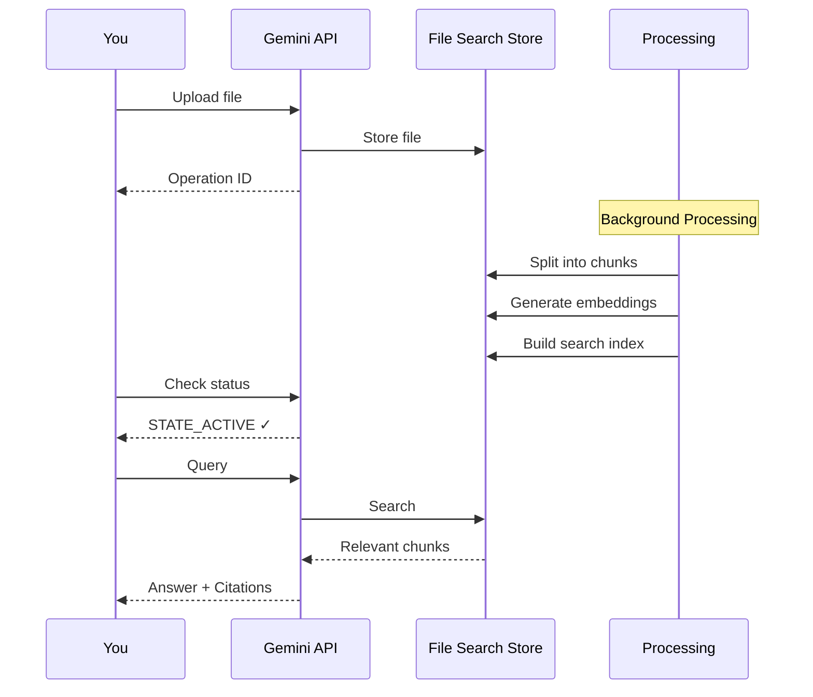

# Uploading Documents

Complete guide to uploading files to your stores.

## The Upload Process

Think of uploading like sending books to a library where a librarian will:
1. **Receive the book** (upload file)
2. **Catalog it** (process and chunk)
3. **Index it** (generate embeddings)
4. **Shelve it** (make searchable)

This all happens automatically - you just upload, wait a bit, then search.

## Basic Upload

### Simplest Example

```python
import os
from dotenv import load_dotenv
from google import genai

load_dotenv()
client = genai.Client(api_key=os.getenv('GEMINI_API_KEY'))

# Upload to existing store
operation = client.file_search_stores.upload_to_file_search_store(
    file='report.pdf',
    file_search_store_name='fileSearchStores/your-store-id'
)
```

**What this code does:**
- Loads your API key from environment variables (secure storage)
- Creates a connection to Gemini's API
- Sends report.pdf to your existing store (think: uploading to a library)
- Returns an operation object (like a tracking number) to monitor progress
- The file immediately starts uploading and processing in the background

That's it! The file is now uploading and processing.

### With Custom Name

```python
operation = client.file_search_stores.upload_to_file_search_store(
    file='Q2_Final_Report_v3.pdf',
    file_search_store_name=store.name,
    config={
        'display_name': 'Q2 2024 Financial Report'  # Cleaner name
    }
)
```

**What this code does:**
- Uploads a file with ugly filename (Q2_Final_Report_v3.pdf)
- Sets a clean, readable display name (Q2 2024 Financial Report)
- Display name is what you'll see in search results and logs
- Actual filename stays the same, but display name makes everything clearer

## Understanding the Upload Flow



### What Happens Behind the Scenes

When you upload a 100-page PDF:

1. **File Received** (seconds)
   - File uploaded to Google's servers
   - Basic validation (format, size)
   - Operation ID returned to you

2. **Document Processing** (30-60 seconds)
   - Text extraction from PDF
   - Splitting into meaningful chunks
   - Each chunk analyzed for meaning

3. **Embedding Generation** (30-60 seconds)
   - Each chunk converted to mathematical representation
   - Embeddings enable semantic search
   - All handled by Google automatically

4. **Indexing** (seconds)
   - Embeddings stored in vector database
   - Search index built
   - Document marked as STATE_ACTIVE

**Total time:** 1-2 minutes for typical documents

## Waiting for Processing

You MUST wait for documents to be processed before querying.

### The Right Way - Poll Until Active

```python
import time

operation = client.file_search_stores.upload_to_file_search_store(
    file='report.pdf',
    file_search_store_name=store.name,
    config={'display_name': 'My Report'}
)

print('Uploading and processing...')

# Wait for operation to complete
while not operation.done:
    operation = client.operations.get(name=operation.name)
    print(f'Status: Processing...')
    time.sleep(2)

print('Upload complete! Document is ready.')
```

**What this code does:**
- Starts uploading report.pdf to your store
- Enters a waiting loop (keeps checking if upload finished)
- Every 2 seconds, asks "Are you done yet?" by checking operation.done
- When operation.done becomes True, exits the loop
- Result: Your code waits until the document is fully processed and searchable

### The Wrong Way - Don't Do This

```python
# BAD: Immediate query
operation = client.file_search_stores.upload_to_file_search_store(
    file='report.pdf',
    file_search_store_name=store.name
)

# This will fail or return empty results!
response = client.models.generate_content(...)  # ❌ Too soon!
```

**What this code does (and why it's wrong):**
- Uploads file and immediately tries to search it
- Problem: File is still processing (not indexed yet)
- Like trying to check out a library book while librarian is still cataloging it
- Result: Empty search results or "document not found" errors

### Check Document State

After upload completes, verify the document is active:

```python
# Get document from operation result
doc_name = operation.response.document.name

# Check state
doc = client.file_search_stores.documents.get(name=doc_name)

if doc.state == 'STATE_ACTIVE':
    print('✓ Ready to query')
elif doc.state == 'STATE_PENDING':
    print('⏳ Still processing, wait longer')
elif doc.state == 'STATE_FAILED':
    print('✗ Processing failed, check document')
```

**What this code does:**
- Gets the document name from completed upload operation
- Fetches current document status from the API
- Checks state: ACTIVE (ready), PENDING (still processing), or FAILED (error)
- Prints user-friendly message based on state
- Think of it as checking if library finished cataloging your book

## Uploading Multiple Files

### Sequential Upload (Simple)

```python
files = ['report1.pdf', 'report2.pdf', 'report3.pdf']

for file in files:
    operation = client.file_search_stores.upload_to_file_search_store(
        file=file,
        file_search_store_name=store.name,
        config={'display_name': file.replace('.pdf', '')}
    )

    # Wait for this file to complete
    while not operation.done:
        operation = client.operations.get(name=operation.name)
        time.sleep(2)

    print(f'✓ {file} uploaded')
```

**What this code does:**
- Loops through 3 PDF files one at a time
- For each file: upload → wait for processing → move to next
- Creates clean display names by removing .pdf extension
- Sequential processing: report1 finishes before report2 starts
- Total time: sum of all individual upload times (slower but simpler)

### Parallel Upload (Faster)

```python
import concurrent.futures

def upload_file(filepath, store_name):
    operation = client.file_search_stores.upload_to_file_search_store(
        file=filepath,
        file_search_store_name=store_name,
        config={'display_name': filepath.split('/')[-1]}
    )

    # Wait for completion
    while not operation.done:
        operation = client.operations.get(name=operation.name)
        time.sleep(2)

    return filepath

files = ['report1.pdf', 'report2.pdf', 'report3.pdf']

with concurrent.futures.ThreadPoolExecutor(max_workers=3) as executor:
    futures = [executor.submit(upload_file, f, store.name) for f in files]

    for future in concurrent.futures.as_completed(futures):
        print(f'✓ {future.result()} uploaded')
```

**What this code does:**
- Creates worker threads (max 3 simultaneous uploads)
- Submits all 3 files to upload simultaneously (not one-at-a-time)
- Each file uploads and processes in parallel
- Prints confirmation as each file completes (whichever finishes first)
- Total time: roughly the time of the slowest single upload (much faster)
- Think: 3 librarians cataloging 3 books at once vs 1 librarian doing all 3

## Adding Metadata

Metadata makes documents searchable by category, date, author, etc.

### Basic Metadata

```python
operation = client.file_search_stores.upload_to_file_search_store(
    file='report.pdf',
    file_search_store_name=store.name,
    config={
        'display_name': 'Q2 Financial Report',
        'custom_metadata': [
            {'key': 'department', 'string_value': 'Finance'},
            {'key': 'year', 'string_value': '2024'},
            {'key': 'quarter', 'string_value': 'Q2'},
            {'key': 'confidential', 'string_value': 'yes'}
        ]
    }
)
```

**What this code does:**
- Uploads report.pdf with attached labels (metadata)
- Adds 4 labels: department, year, quarter, confidential
- Think of metadata like sticky notes on a file folder
- Later you can search "only Finance docs from Q2 2024"
- Makes finding specific documents much faster and more accurate

### Why Metadata Matters

**Without metadata:**
You upload 100 documents. To find Q2 financial reports, you must:
1. Query all 100 documents
2. Hope semantic search finds the right ones
3. Manually filter results

**With metadata:**
```python
# Query only Q2 financial documents
response = client.models.generate_content(
    model='gemini-2.5-flash',
    contents='What was total revenue?',
    config=types.GenerateContentConfig(
        tools=[types.Tool(
            file_search=types.FileSearch(
                file_search_store_names=[store.name],
                metadata_filter='quarter=Q2 AND department=Finance'
            )
        )]
    )
)
```

**What this code does:**
- Asks "What was total revenue?" but ONLY searches Q2 Finance documents
- metadata_filter acts like a pre-filter before search
- Skips all non-Finance, non-Q2 documents entirely
- Result: Faster search, more accurate answer (correct quarter/department)
- Without filter: might get revenue from wrong quarter or department

Searches only relevant documents - faster and more accurate.

### Metadata Best Practices

**Good metadata keys:**
- `department` - Finance, Engineering, HR
- `year` - 2024, 2023
- `quarter` - Q1, Q2, Q3, Q4
- `category` - financial, technical, legal
- `author` - person or team name
- `status` - draft, final, archived
- `project` - project name or ID

**Max 20 key-value pairs per document**

## Uploading Different File Types

### PDFs (Most Common)

```python
operation = client.file_search_stores.upload_to_file_search_store(
    file='annual_report.pdf',
    file_search_store_name=store.name,
    config={'display_name': 'Annual Report 2024'}
)
```

**What this code does:**
- Uploads a PDF file to your store
- PDF text automatically extracted and indexed
- Works best with text-based PDFs (not scanned images)
- After processing, you can search the contents

Works with:
- Text-based PDFs ✓
- Scanned PDFs with embedded text ✓
- Image-only PDFs (limited OCR) ⚠️

### Word Documents

```python
operation = client.file_search_stores.upload_to_file_search_store(
    file='policy.docx',
    file_search_store_name=store.name
)
```

**What this code does:**
- Uploads Word document (.docx or .doc)
- Text automatically extracted from Word formatting
- Headers, paragraphs, tables all indexed
- Works same as PDF - upload and search

Supports: .docx, .doc

### Excel Spreadsheets

```python
operation = client.file_search_stores.upload_to_file_search_store(
    file='sales_data.xlsx',
    file_search_store_name=store.name
)
```

**What this code does:**
- Uploads Excel spreadsheet
- Extracts text from all sheets (sheet names, headers, cell values)
- Best for spreadsheets with descriptions/text, not just numbers
- After indexing, you can search cell contents

Extracts:
- Sheet names
- Cell values
- Column headers

Best for: Reports with text descriptions, not pure number tables

### Code Files

```python
files = ['main.py', 'utils.js', 'README.md']

for file in files:
    operation = client.file_search_stores.upload_to_file_search_store(
        file=file,
        file_search_store_name=store.name
    )
```

**What this code does:**
- Uploads code files (Python, JavaScript, Markdown)
- Code indexed as plain text - searchable line by line
- Can later ask "Where is the login function?" or "How does authentication work?"
- Good for creating searchable code documentation

Great for:
- Code documentation
- Finding specific functions
- Understanding architecture

### Text Files

```python
operation = client.file_search_stores.upload_to_file_search_store(
    file='meeting_notes.txt',
    file_search_store_name=store.name
)
```

**What this code does:**
- Uploads plain text file
- Simplest format - entire content indexed as-is
- Works with any text-based file format
- After processing, full text searchable

Supports: .txt, .md, .rtf

### ZIP Archives (Auto-Extracted)

```python
operation = client.file_search_stores.upload_to_file_search_store(
    file='project_docs.zip',
    file_search_store_name=store.name
)
```

**What this code does:**
- Uploads ZIP archive (compressed folder)
- Automatically unzips and uploads each file inside separately
- Folder structure preserved in document names
- One upload = many documents indexed
- Perfect for bulk uploading entire document collections

Automatically:
- Extracts all files
- Uploads each individually
- Preserves folder structure in names

Perfect for: Bulk uploading entire document sets

## File Size and Limits

| What | Limit |
|------|-------|
| Max file size | 100 MB |
| Total storage (free tier) | 1 GB |
| Recommended file size | < 10 MB for fast processing |
| Processing time (1 MB) | ~30-60 seconds |
| Processing time (10 MB) | ~2-3 minutes |
| Processing time (100 MB) | ~5-10 minutes |

### If Your File is Too Large

**Option 1: Split the PDF**

```bash
# Using PyPDF2
pip install PyPDF2

python split_pdf.py large_file.pdf
# Creates: page_1.pdf, page_2.pdf, ...
```

**Option 2: Compress the PDF**

Use online tools or:
```bash
# Using Ghostscript
gs -sDEVICE=pdfwrite -dCompatibilityLevel=1.4 \
   -dPDFSETTINGS=/ebook -dNOPAUSE -dQUIET \
   -dBATCH -sOutputFile=compressed.pdf input.pdf
```

**Option 3: Extract text only**

```python
# Upload as plain text instead
import PyPDF2

with open('large.pdf', 'rb') as f:
    reader = PyPDF2.PdfReader(f)
    text = '\n'.join(page.extract_text() for page in reader.pages)

with open('extracted.txt', 'w') as f:
    f.write(text)

# Upload text file (much smaller)
operation = client.file_search_stores.upload_to_file_search_store(
    file='extracted.txt',
    file_search_store_name=store.name
)
```

**What this code does:**
- Opens large PDF that's too big to upload
- Extracts all text from every page
- Saves text to .txt file (much smaller than PDF)
- Uploads the text file instead of original PDF
- Result: Searchable content without huge file size
- Trade-off: Loses images, formatting, but keeps all text

## Troubleshooting Uploads

### Upload Hangs

**Cause:** Network timeout or large file

**Solution:**
- Check internet connection
- Try smaller file
- Increase timeout in code

### STATE_FAILED After Upload

**Possible causes:**
1. **Unsupported format** - Check file extension
2. **Corrupted file** - Try opening file locally first
3. **Empty file** - Verify file has content
4. **Encoding issues** - Use UTF-8 for text files

**Check error:**
```python
doc = client.file_search_stores.documents.get(name=doc_name)
if doc.state == 'STATE_FAILED':
    print(f'Failed: {doc}')  # Check for error details
```

**What this code does:**
- Fetches document details after upload fails
- Checks if state is FAILED
- Prints full document object with error details
- Helps diagnose why processing failed (corrupt file, unsupported format, etc.)

### Document Not Found After Upload

**Cause:** Querying before processing complete

**Solution:** Always poll operation until `done=True`

### Slow Processing

**Cause:** Large file or peak usage times

**Solution:**
- Be patient (large files take time)
- Upload during off-peak hours
- Consider splitting large files

## Best Practices

1. **Use descriptive display names** - "Q2 Report" not "document_final_v3.pdf"
2. **Add metadata** - Makes filtering faster and more accurate
3. **Wait for STATE_ACTIVE** - Never query before processing completes
4. **Upload in batches** - Parallel upload for multiple files
5. **Compress large files** - Faster upload and processing
6. **Use UTF-8 encoding** - For text files to avoid encoding errors
7. **Verify formats** - Check supported formats before uploading
8. **Monitor storage** - Track usage against tier limits
9. **Clean up** - Delete old/unused documents regularly

## Next Steps

- [Query Your Documents →](./query)
- [Metadata Filtering →](./metadata-filtering)
- [Document States →](../concepts/documents)
- [Production Deployment →](./production-deployment)
